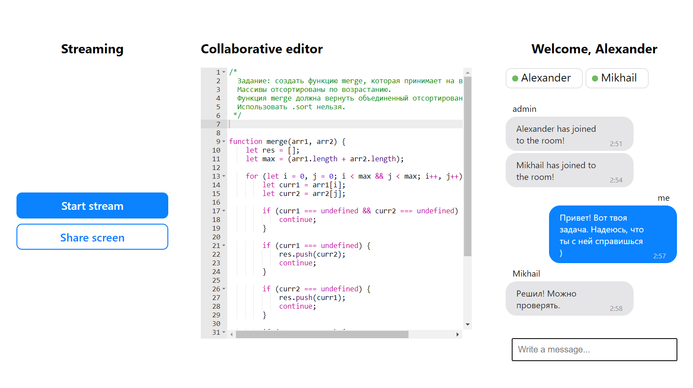

# aitmo client

Приложение для удобного проведения вебинаров, совместной работы,
экзаменации, собеседований. Использует технологию WebRTC. Сделано с использованием библиотеки React.

Демо доступно здесь [https://aitmo.onrender.com/](https://aitmo.onrender.com/)

- Установить зависимости `npm install`
- Запустить сначала [сервер](https://github.com/sanicDogg/aitmo-server), затем клиент `npm start`

## Инструкция

1. Перейдите по ссылке, нажмите кнопку "Create Room", чтобы создать комнату
2. Введите Ваше имя и нажмите "Ок"
3. Скопируйте текущий адрес и отправьте ссылку друзьям
4. Начните общаться, стримить или писать код вместе с другими участниками Вашей комнаты

### Справка

По умолчанию порт сервера 5000, порт клиента 3000.

Приложение использует библиотеки Socket.io и Peer.js для коммуникации между участниками.

Имя пользователя хранится в localStorage, поэтому
с новой вкладки браузера подключения не будет. Для проверки используйте режим инкогнито, другой браузер или компьютер.

Если нужно будет сменить имя, нажмите на него мышью вверху после слова Welcome.

**При развертывании (деплое) приложения, задайте переменную окружения `AITMO_HOST`, в которой будет находиться URL [сервера](https://github.com/sanicdogg/aitmo-server).**

Пример для Linux:

```
AITMO_HOST=https://example.com
```

### STUN/TURN

Серверы заимствуются отсюда:
[https://www.metered.ca/tools/openrelay/](https://www.metered.ca/tools/openrelay/)

В файле `src/config/ice-servers.json` установлены адреса STUN и TURN серверов

Готовый Docker контейнер с TURN сервером можно найти здесь:

[https://devblogs.microsoft.com/cse/2018/01/29/orchestrating-turn-servers-cloud-deployment/](https://devblogs.microsoft.com/cse/2018/01/29/orchestrating-turn-servers-cloud-deployment/)

### Сервер
Ссылка на репозиторий с сервером:

[https://github.com/sanicDogg/aitmo-server](https://github.com/sanicDogg/aitmo-server)


